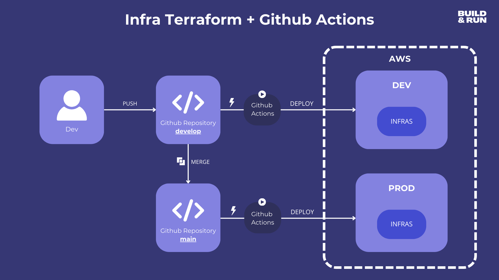
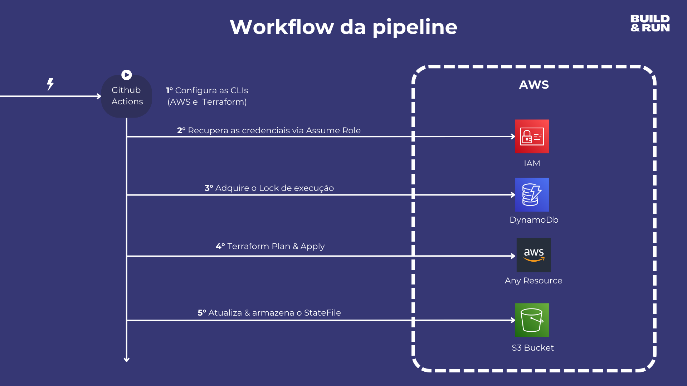

<h1 align="center">
    Pipeline de Infraestrutura (AWS + Terraform + Github Actions + Multi Env)
</h1>

    
    

## Fluxo da Pipeline

    

    

## Para começar
- Crie o Identity Provider do Github em sua conta AWS
- Crie uma IAM Role em sua conta AWS (Permissão mínima de S3 e DynamoDB)
- Crie um Bucket S3 em sua conta AWS (Habilite o Bucket Versioning)
- Crie uma tabela no DynamoDB na sua conta AWS (PartitionKey com o nome "LockID")
- Clone esse repositório
- Configure os arquivos workflow
- Pronto! Você já está habilitado para implantar infras na AWS com Terraform via pipeline

🚀 Baixe o projeto e teste você mesmo na prática 😉